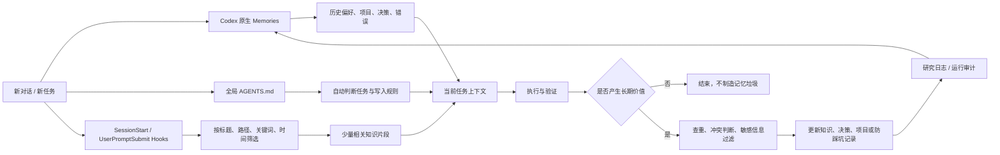

# 机制架构

## 分工

- Memories：本机跨会话召回。
- 用户级 AGENTS：每次新会话自动读取，并与项目规则按层级合并。
- Skill：需要完整工作流时按需加载。
- 用户级 Hooks：信任一次后，在每次新会话和提问时确定性执行，不依赖插件选择。
- 知识库：用户可见、可审计、可迁移的长期资产。
- 安装器：合并配置、备份、安装和回滚。

## 零触发保障

安装器不把“加入 Marketplace”误当成“插件已经启用”。它直接在当前
`CODEX_HOME` 中配置生效的全局 AGENTS 文件、`hooks.json`、Hook 运行脚本和
Memories。Marketplace 与 Skill 作为可发现、可维护的分发层存在，不承担核心自动
启动职责。
